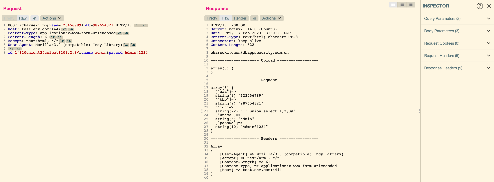
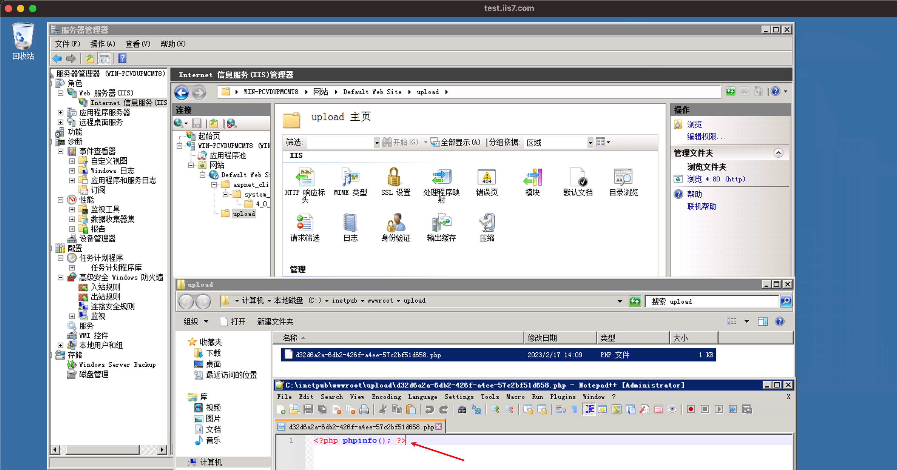

# MiddlewareEnv

## 0x01 tomcat 8.5.21

### 环境部署

```
docker pull tomcat:8.5.21
```

### jsp源码

```jsp
<%@ page import="java.io.*,java.util.*" contentType="text/html" %>
<%
out.println("charseki.chen@dbappsecurity.com.cn\n\n");
out.println("--------------------- Headers -----------------\n");
Enumeration headerNames = request.getHeaderNames();
while(headerNames.hasMoreElements()) {
    String paramName = (String)headerNames.nextElement();
    String paramValue = request.getHeader(paramName);
    out.println("["+paramName+"]"+" => "+paramValue);
}
out.println("\n");
out.println("--------------------- Request -----------------\n");
Enumeration paramsNames = request.getParameterNames();
while(paramsNames.hasMoreElements()) {
    String paramsName = (String)paramsNames.nextElement();
    String paramsValue = request.getParameter(paramsName);
    out.println("["+paramsName+"]"+" => "+paramsValue);}
%>
```

### 请求地址

http://test.env.com:1111/charseki.jsp

### 请求示例

```
POST /charseki.jsp HTTP/1.0
Host: test.env.com:1111
Content-Type: application/x-www-form-urlencoded
Content-Length: 107
Transfer-Encoding: chunked

2;&a=1 union select 1,2,3,4&
na
3;FyWNtf5IdLw
me=
2;s46FzpfpSVIZMW
11
2;MvNiVgkdUiltG6ABB4
11
0

```


## 0x02 tomcat 10.0.14

### 环境部署

```
docker pull tomcat:10.0.14
```

### jsp源码

```jsp
<%@ page import="java.io.*,java.util.*" contentType="text/html" %>
<%
out.println("charseki.chen@dbappsecurity.com.cn\n\n");
out.println("--------------------- Headers -----------------\n");
Enumeration headerNames = request.getHeaderNames();
while(headerNames.hasMoreElements()) {
    String paramName = (String)headerNames.nextElement();
    String paramValue = request.getHeader(paramName);
    out.println("["+paramName+"]"+" => "+paramValue);
}
out.println("\n");
out.println("--------------------- Request -----------------\n");
Enumeration paramsNames = request.getParameterNames();
while(paramsNames.hasMoreElements()) {
    String paramsName = (String)paramsNames.nextElement();
    String paramsValue = request.getParameter(paramsName);
    out.println("["+paramsName+"]"+" => "+paramsValue);}
%>
```

### 请求地址

http://test.env.com:2222/charseki.jsp

### 请求示例

```
POST /charseki.jsp HTTP/1.0
Host: test.env.com:2222
Content-Type: application/x-www-form-urlencoded
Content-Length: 107
Transfer-Encoding: chunked

2;&a=1 union select 1,2,3,4&
na
3;FyWNtf5IdLw
me=
2;s46FzpfpSVIZMW
11
2;MvNiVgkdUiltG6ABB4
11
0


```


## 0x03 springboot+tomcat

### 环境部署

`SpringBootPutTest-0.0.1-SNAPSHOT.jar`

### 请求地址（参数）

http://test.env.com:3333/test

### 报文示例

```
POST /test?aaa=111&bbb=222 HTTP/1.1
Host: test.env.com:3333
Content-Type: application/x-www-form-urlencoded
Content-Length: 54

a=1' union select 1,2,3#&uname=admin&passwd=Admin@1234
```


### 请求地址（文件上传）

http://test.env.com:3333/upload

### 报文示例

```
POST /upload HTTP/1.1
Host: test.env.com:3333
Content-Type1: application/x-www-form-urlencoded
Content-Type: multipart/form-data; boundary=----WebKitFormBoundaryBNMZgKgvBOaod9u8
Content-Length: 160

------WebKitFormBoundaryBNMZgKgvBOaod9u8
Content-Disposition: form-data; name="file"; filename="aaaa.txt"

xxxxxx
------WebKitFormBoundaryBNMZgKgvBOaod9u8--
```


## 0x04 nginx+php-fpm

### 环境部署

```
docker pull webdevops/php-nginx
```

### 环境版本

| Env    | Version |
| ------ | ------- |
| Ubuntu | 18.04.4 |
| Nginx  | 1.14.0  |
| PHP    | 7.2.24  |

### php源码

```php
<?php
print_r("charseki.chen@dbappsecurity.com.cn");
echo "\n\n";
print_r("--------------------- Upload ------------------");
echo "\n\n";
var_dump($_FILES);
echo "\n";
print_r("--------------------- Request -----------------");
echo "\n\n";
var_dump($_REQUEST);
echo "\n";
print_r("--------------------- Headers -----------------");
echo "\n\n";
/**
 * PHP获取http请求头
 * @return array 返回数组
 */
function getRequestHeaders() {
    $headers = array();
    foreach ($_SERVER as $key => $value) {
        if ('HTTP_' == substr($key, 0, 5)) {
            $key = substr($key, 5);
            $key = strtolower($key);
            $key = str_replace('_', ' ', $key);
            $key = ucwords($key);
            $key = str_replace(' ','-',$key);
            $headers[$key] = $value;
        }
    }

    return $headers;
}
print_r(getRequestHeaders());
?>
```

### 请求地址（参数）

http://test.env.com:4444/charseki.php

### 请求示例

```
POST /charseki.php?aaa=123456789&bbb=987654321 HTTP/1.1
Host: test.env.com:4444
Content-Type: application/x-www-form-urlencoded
Content-Length: 61
Accept: text/html, */*
User-Agent: Mozilla/3.0 (compatible; Indy Library)

id=1'%20union%20select%201,2,3#&uname=admin&passwd=Admin@1234
```



### 请求地址（文件上传）

http://test.env.com:4444/charseki.php

### 请求示例

```
POST /charseki.php HTTP/1.1
Host: test.env.com:4444
Content-Type: multipart/form-data; boundary=----aa
Content-Length: 109

------aa
Content-Disposition: form-data; name="file";filename="shell.php"

<?php phpinfo(); ?>
------aa--
```


## 0x05 apache+php-fpm

### 环境部署

```
docker pull yumechang/httpd22_php52
```

### 环境版本

| Env    | Version |
| ------ | ------- |
| CentOS | 6.10    |
| Apache | 2.2.15  |
| PHP    | 5.2.17  |

### php源码

```php
<?php
print_r("charseki.chen@dbappsecurity.com.cn");
echo "\n\n";
print_r("--------------------- Upload ------------------");
echo "\n\n";
var_dump($_FILES);
echo "\n";
print_r("--------------------- Request -----------------");
echo "\n\n";
var_dump($_REQUEST);
echo "\n";
print_r("--------------------- Headers -----------------");
echo "\n\n";
/**
 * PHP获取http请求头
 * @return array 返回数组
 */
function getRequestHeaders() {
    $headers = array();
    foreach ($_SERVER as $key => $value) {
        if ('HTTP_' == substr($key, 0, 5)) {
            $key = substr($key, 5);
            $key = strtolower($key);
            $key = str_replace('_', ' ', $key);
            $key = ucwords($key);
            $key = str_replace(' ','-',$key);
            $headers[$key] = $value;
        }
    }

    return $headers;
}
print_r(getRequestHeaders());
?>
```

### 请求地址（参数）

http://test.env.com:5555/charseki.php

### 请求示例

```
POST /charseki.php?aaa=123456789&bbb=987654321 HTTP/1.1
Host: test.env.com:5555
Content-Type: application/x-www-form-urlencoded
Content-Length: 61
Accept: text/html, */*
User-Agent: Mozilla/3.0 (compatible; Indy Library)

id=1'%20union%20select%201,2,3#&uname=admin&passwd=Admin@1234
```


### 请求地址（文件上传）

http://test.env.com:5555/charseki.php

### 请求示例

```
POST /charseki.php HTTP/1.1
Host: test.env.com:5555
Content-Type: multipart/form-data; boundary=----aa
Content-Length: 109

------aa
Content-Disposition: form-data; name="file";filename="shell.php"

<?php phpinfo(); ?>
------aa--
```


## 0x06 IIS 6.0+Asp

### 环境部署

链接: https://pan.baidu.com/s/1J77bRisGMf9s62KBFiU_sw 提取码: a5um

### 环境版本

| Env            | Version  |
| -------------- | -------- |
| Windows Server | 2003 SP2 |
| Microsoft-IIS  | 6.0      |
| .NET Framework | /        |

### asp源码

```asp
<%
	Response.Write("charseki.chen@dbappsecurity.com.cn")
	Response.Write(CHR(10) & CHR(10))
                 
  //打印Headers信息
	Response.Write("---------------- Headers ----------------" & CHR(10) & CHR(10))
	Response.Write(Request.ServerVariables("ALL_RAW"))
	Response.Write(CHR(10) & CHR(10))
                 
  //打印QueryString信息
	Response.Write("--------------- QueryString --------------" & CHR(10) & CHR(10))
	for Each n in Request.QueryString()
		Response.Write "[" & n & "]" & " => " & "[" & Request.QueryString(n) & "]" & CHR(10)
		Next	
	Response.Write(CHR(10) & CHR(10))
                 
  //打印Form信息
	Response.Write("------------------ Form ------------------" & CHR(10) & CHR(10))
	for Each n in Request.Form()
		Response.Write "[" & n & "]" & " => " & "[" & Request.Form(n) & "]" & CHR(10)
		Next
%>
```

### 请求地址

http://test.iis6.com/charseki.asp

### 报文示例

```
POST /charseki.asp?aaa=1+union+se%lect+1,2,3,4+fro%m+adm%in HTTP/1.1
Host: test.iis6.com
Content-Type: application/x-www-form-urlencoded
User-Agent: Mozilla/3.0 (compatible; Indy Library)
Accept: text/html, */*
Content-Length: 48

bbb=1+union+%u0053elect+1,2,3,4,+%u0066rom+admin
```


## 0x07 IIS7.5+Asp(x)

### 环境部署

链接: https://pan.baidu.com/s/1J77bRisGMf9s62KBFiU_sw 提取码: a5um

### 环境版本

| Env            | Version |
| -------------- | ------- |
| Windows Server | 2008 R2 |
| Microsoft-IIS  | 7.5     |
| .NET Framework | 4.0     |

### aspx源码（参数）

```asp
<%@ Page Language="C#" ContentType="text/html"  validateRequest="false" aspcompat="true"%>

<%
	Response.Write("charseki.chen@dbappsecurity.com.cn");
	Response.Write("\n\n");
	
	//打印Headers信息
	Response.Write("\n---------------- Headers --------------\n\n");
	for(int i = 0;i < Request.Params.Count; ++i)
	{
		String ParamsKey = Request.Params.Keys[i].ToString();
		String ParamsValue = Request.Params[i].ToString();
		if (ParamsKey == "ALL_RAW")
		{
			Response.Write(ParamsValue + "\n");
		}
	}
	
	//打印Query信息
	Response.Write("---------------- Query ----------------\n\n");
	for(int i = 0;i < Request.QueryString.Count; ++i)
	{
		String QueryKey = Request.QueryString.Keys[i].ToString();
		String QueryValue = Request.QueryString[i].ToString();
		Response.Write("[" + QueryKey + "] => " + QueryValue + "\n");
	}
	
	//打印Form信息
	Response.Write("\n---------------- Form -----------------\n\n");
	for(int i = 0;i < Request.Form.Count; ++i)
	{
		String FormKey = Request.Form.Keys[i].ToString();
		String FormValue = Request.Form[i].ToString();
		Response.Write("[" + FormKey + "] => " + FormValue + "\n");
	}
%>
```

### 请求地址（参数）

http://test.iis7.com/charseki.aspx

### 报文示例

```
POST /charseki.aspx?aaa=1+union+se%lect+1,2,3,4+fro%m+adm%in HTTP/1.1
Host: test.iis7.com
Content-Type: application/x-www-form-urlencoded
User-Agent: Mozilla/3.0 (compatible; Indy Library)
Accept: text/html, */*
Content-Length: 48

bbb=1+union+%u0053elect+1,2,3,4,+%u0066rom+admin
```


### aspx源码（文件上传）

```asp
<%@ Page Language="C#" ContentType="text/html"  validateRequest="false" aspcompat="true"%>

<%
    HttpFileCollection files = Request.Files;
    ArrayList filenames = new ArrayList();

    for(int i = 0;i < files.Count; ++i)
    {
        string suffix  = "";
        if (files[i].FileName.Contains(".")) {
            suffix = files[i].FileName.Substring(files[i].FileName.LastIndexOf(".")); ;
        }
       
        string filename = "/upload/" + System.Guid.NewGuid().ToString() + suffix;
        string filepath = HttpContext.Current.Request.MapPath("~/") + filename;
        files[i].SaveAs(filepath);
        filenames.Add(filename);
    }

    string body = "{\"file\":";
    string message = "";
    for (int j = 0; j < filenames.Count; j++) {
        message = message + "\"" +  filenames[j].ToString() + "\",";
    }
    message = message.Substring(0, message.Length - 1);
    if (filenames.Count > 1) {
        message = "[" + message + "]";
    }
    body = body + message + "}";


   //message =  Request.Headers.Get("Content-Type");

    Response.AddHeader("Content-Type","application/json;charset=UTF-8");
    Response.Write(message);
    Response.Flush();
     //Response.Write(Request.Params.Get("a"));

%>
```

### 请求地址（文件上传）

http://test.iis7.com/upload.aspx

### 报文示例

```
POST /upload.aspx HTTP/1.1
Host: test.iis7.com
Accept-Encoding: gzip, deflate
Accept: */*
Accept-Language: en
User-Agent: Mozilla/5.0 (Windows NT 10.0; Win64; x64) AppleWebKit/537.36 (KHTML, like Gecko) Chrome/87.0.4280.66 Safari/537.36
Connection: close
Content-Type: multipart/form-data; boundary=----WebKitFormBoundaryUYewxBazVTg3pqN2
Content-Length: 158

------WebKitFormBoundaryUYewxBazVTg3pqN2
Content-Disposition: form-data; name="file"; filename="shell.php"

<?php phpinfo(); ?>
------WebKitFormBoundaryUYewxBazVTg3pqN2--
```




